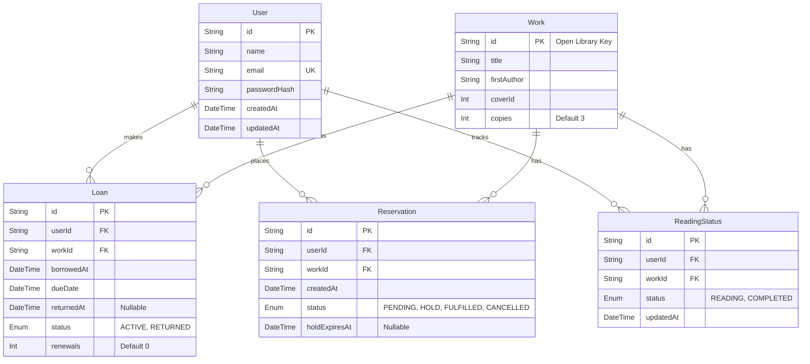
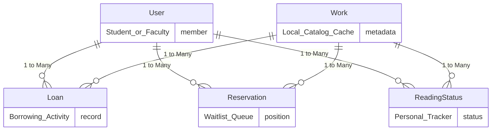

# Database Design

## 1. Relational Model (Schema Details)

This diagram represents the physical database structure, including column types, primary keys (PK), foreign keys (FK), and exact relationships.

## 2. Conceptual Entity-Relationship (ER) Diagram

This diagram focuses purely on the high-level business concepts and how they relate to one another, abstracting away the technical column details.

